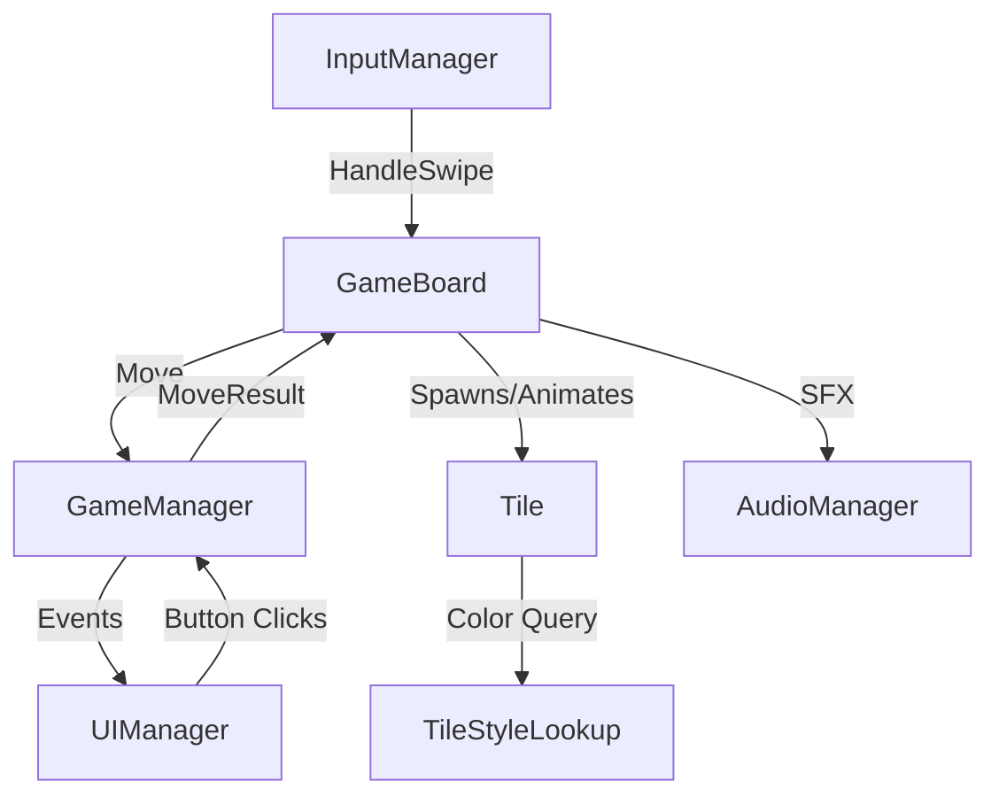

# 2048 Slide & Match — Unity Setup Guide

> [!TIP]
> The game **works out of the box** with zero manual setup. Just follow Step 1 and 2 below, hit Play, and you'll have a fully functional 2048 game. The remaining steps are optional polish.

---

## Step 1 — Open Your Project

Open the Unity project at `D:\Unity Learning\Puzzle Game` in Unity 6.

All scripts are already in:
```
Assets/_My Files/Scripts/
```

---

## Step 2 — Create the Scene Hierarchy (Minimal)

1. Open your scene (or create a new one: **File → New Scene → Basic 2D**)
2. Create an **empty GameObject**, name it `GameController`
3. Add these 5 components to `GameController` (Add Component → search by name):

| Component | Notes |
|-----------|-------|
| `GameManager` | Core game engine |
| `GameBoard` | Creates the visual grid |
| `InputManager` | Handles keyboard + swipe |
| `UIManager` | Creates score/buttons/overlays |
| `AudioManager` | Procedural sound effects |

4. **That's it!** Press **▶ Play** — the game auto-creates all visuals, UI, and camera settings.

> [!NOTE]
> The scripts auto-find each other via singletons and `FindAnyObjectByType`. No manual drag-and-drop wiring is needed for the basic setup.

---

## Step 3 — Controls

| Input | Action |
|-------|--------|
| Arrow Keys / WASD | Slide tiles |
| Mouse click+drag | Swipe direction |
| Touch swipe (mobile) | Swipe direction |
| UI buttons | New Game / Undo |

---

## Step 4 (Optional) — Custom Tile Prefab

For a more polished look, create a tile prefab:

1. **Create a Sprite** for the tile background:
   - In `Assets`, right-click → **Create → Sprites → Square**
   - Or import a rounded-rectangle PNG for nicer corners

2. **Build the prefab**:
   - Create an empty GameObject, name it `TilePrefab`
   - Add a **SpriteRenderer** → assign your square sprite
   - Set **Sorting Order** = `1`
   - Create a **child** GameObject named `Label`
   - Add **TextMeshPro** (not UGUI) to `Label`
   - Set **Alignment** = Center, **Font Style** = Bold
   - Enable **Auto Size** with Min = 1, Max = 8
   - Set Label's **Sorting Order** = `2`
   - Set Label's **RectTransform Size** = (0.85, 0.85)

3. **Add the Tile component** to the root:
   - Drag the SpriteRenderer into the `Background` field
   - Drag the TextMeshPro into the `Label` field

4. **Drag to Project** to create a prefab, then delete from scene

5. **Assign**: Select `GameController` → `GameBoard` → drag the prefab into the **Tile Prefab** slot

---

## Step 5 (Optional) — Custom Canvas UI

If you want full control over the UI design:

1. Create a **Canvas** (ScreenSpace - Overlay)
2. Add a **CanvasScaler**: Scale With Screen Size, Reference = 1080 × 1920
3. Build your UI hierarchy:

```
Canvas
├── TitleText (TextMeshProUGUI) — "2048"
├── ScoreBox (Image background)
│   ├── ScoreLabel — "SCORE"
│   └── ScoreValue — "0"  ← assign to UIManager.scoreText
├── BestBox (Image background)
│   ├── BestLabel — "BEST"
│   └── BestValue — "0"   ← assign to UIManager.bestScoreText
├── NewGameBtn (Button)     ← assign to UIManager.newGameButton
├── UndoBtn (Button)        ← assign to UIManager.undoButton
├── GameOverPanel (inactive)
│   ├── Title — "GAME OVER"
│   └── RetryBtn (Button)  ← assign to UIManager.retryButton
└── WinPanel (inactive)
    ├── Title — "YOU WIN!"
    ├── KeepPlayingBtn      ← assign to UIManager.keepPlayingButton
    └── WinNewGameBtn       ← assign to UIManager.winNewGameButton
```

4. Assign all references in the `UIManager` Inspector fields
5. The auto-created UI is skipped when any reference is assigned

---

## Step 6 (Optional) — Safe Area (Mobile Notches)

1. In your Canvas, create a child **Panel** named `SafeAreaPanel`
2. Stretch it to fill the Canvas (anchor 0,0 → 1,1)
3. Add the `SafeAreaHandler` component
4. Put all other UI elements **inside** this panel

---

## Step 7 — Android Build Settings

1. **File → Build Settings → Android → Switch Platform**
2. **Player Settings**:
   - **Resolution**: Portrait only
   - **Default Orientation**: Portrait
   - **Minimum API Level**: 24 (Android 7.0+)
3. **Build & Run** or export APK

---

## Architecture Reference



---

## Troubleshooting

| Problem | Fix |
|---------|-----|
| No text visible on tiles | **Window → TextMeshPro → Import TMP Essential Resources** |
| Tiles appear white | Check that `TileStyleLookup` colours parse — ensure the script compiled without errors |
| Camera shows nothing | Verify camera is Orthographic with Size ≈ 5.5 |
| Buttons don't respond | Ensure an EventSystem exists in the scene (auto-created by UIManager, but check) |
| Swipe too sensitive/insensitive | Adjust `Swipe Threshold` on `InputManager` (default 50px) |
